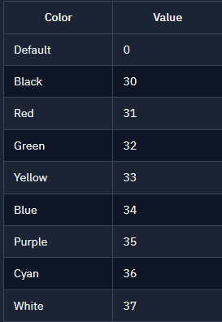

How does it work?
It's all just print statements, but using special codes that tell your console to start printing everything after this point in the new color.
You will need to reset if you want to go back and change it in previous lessons.

The somewhat random characters in the print argument are telling the computer to change the color of the next text output to whichever color you pick.
You must add the number from the table below.

