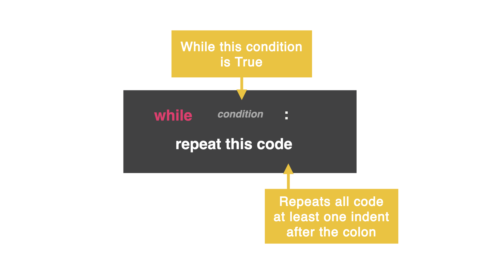

## 👉 Day 15 Challenge
# Write a program that loops. Inside the loop, ask the user what animal sound they want to hear.


- All About Loops
On Day 14, you created an epic rock, paper, scissors game, but we had to click run every time (which makes for a terrible experience!) Let's fix that with a while loop...

-While Loop
A while loop allows your code to repeat itself based on a condition you set.

It is similar to an if statement in that you ask a question, and as long as the answer is true, the computer will repeatedly run the code.



In the code below, the variable is called counter and starts at zero. The while loop has the condition saying, "while the counter is less than ten do this..."

In this case, print the variable and then add +=1 to that variable. As long as variable is less than 10, the loop will repeat the code.

```python 
counter = 0
while counter < 10:
  print(counter)
  counter +=1
  ```
👉 Try it out!

- Infinite Loop
You have to be really careful that you don't accidentally invoke an infinite loop! This is where the computer will loop code until the end of time. Without a break. Forever. 😭

Fix an infinite loop by adding:
  variable +=1
This is just saying "count to 10 by 1 each time." to make the loop end.

Don't forget, if your condition is a > then you might need to -=. This will subtract from the variable instead of adding to it.