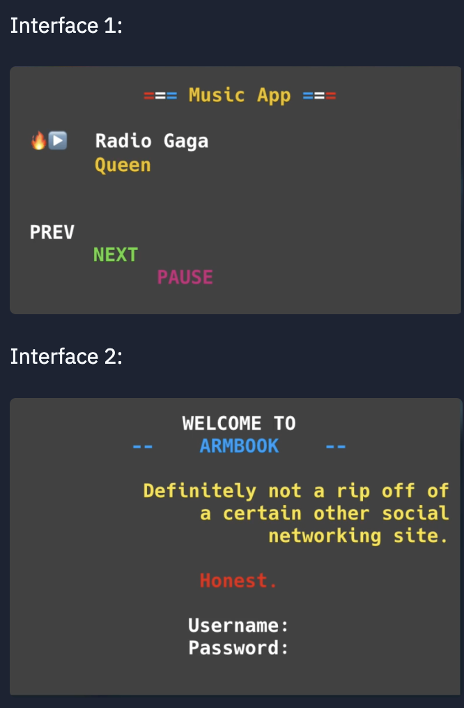

## 👉 Day 31 Challenge
# Create a classic user interface using string manipulation.

Create these two user interfaces (below) using everything you know about extensions to print statements and f-strings.

The second one is a bit more tricky as it involves alignment.

There are no input statements. This is all about using print and variables in interesting ways. However, you may want to create a subroutine to make the color changing easier.

